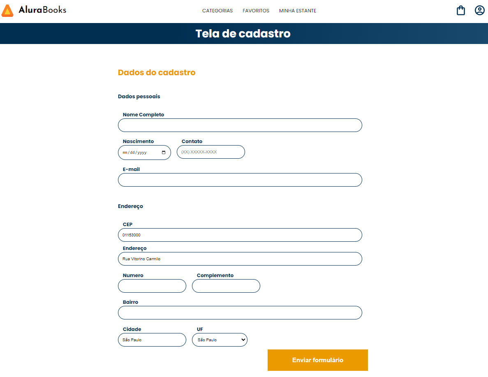

  

## 🖥️ Projeto

O projeto é um estudo de JavaScript para implementação de APIs. O objetivo é usar async/await para buscar o cep correspondente de forma automatizada, fazer tratamento de erros através do try/catch e manipular o DOM para que preencha campos do formulário de forma automática para que se evite erros do usuário. 

## 🚀 Tecnologias

Esse projeto foi desenvolvido com as seguintes tecnologias:

- HTML
- CSS
- JAVASCRIPT
- GIT e GITHUB

