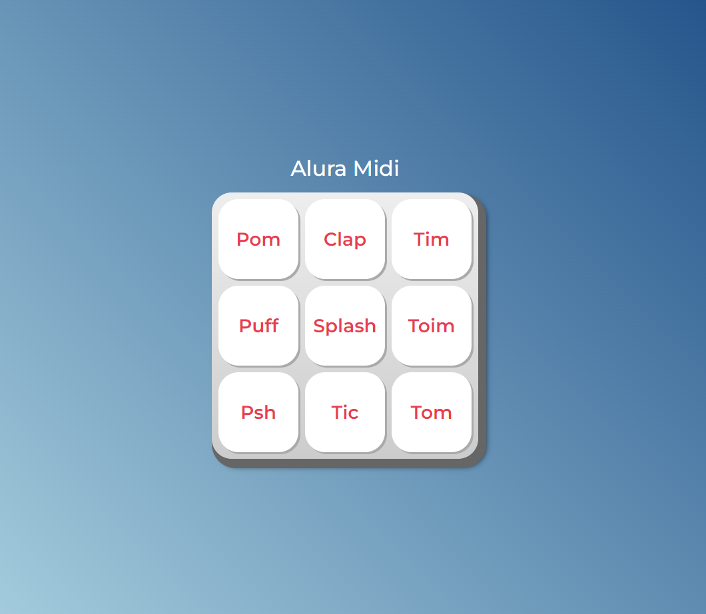

  

## 🖥️ Projeto

O projeto é um estudo de Javascript para o curso Oracle ONE em parceria com a Alura, onde estudamos funções, listas e manipulação de elementos no DOM.

## 🛠️ Funcionalidades

O usuário poderá clicar nos botões para ouvir os áudios ou utilizar o tab no teclado para navegar pelos botões e pressionar enter ou espaço para ouvir os sons. 

## 🚀 Tecnologias

Esse projeto foi desenvolvido com as seguintes tecnologias:

- HTML
- CSS
- JAVASCRIPT
- GIT e GITHUB

